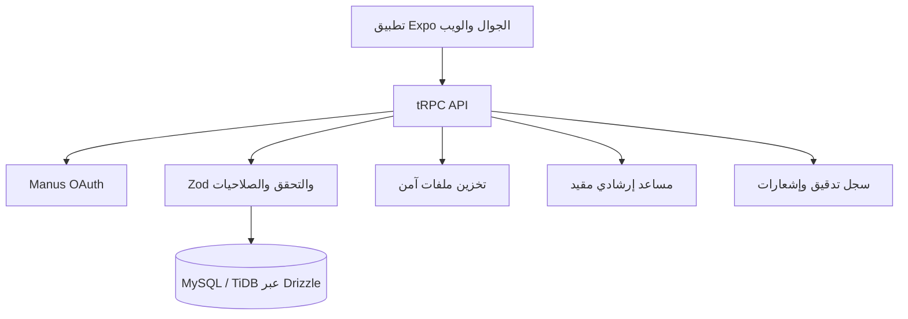

# معمارية النظام

تتصل الواجهة بالخادم عبر tRPC. تفرض إجراءات الخادم المصادقة والصلاحيات قبل القراءة أو التعديل. يحتفظ Drizzle بالمخطط والهجرات، ويستخدم التخزين السحابي للملفات فقط مع الاحتفاظ بمراجعها في القاعدة. لا يدخل أي تكامل حكومي مباشر في هذا التصميم.

